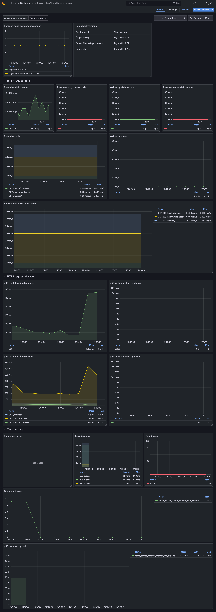

# Self-hosted Flagsmith example

This example deploys Flagsmith Enterprise to a Kubernetes cluster using a Helmfile. It also deploys
[kube-prometheus-stack](https://github.com/prometheus-community/helm-charts/tree/main/charts/kube-prometheus-stack) with
Grafana for monitoring.

The Helm values in this example will deploy an in-cluster, single-node PostgreSQL database. In production, you should
remove the [`devPostgresql` values](https://artifacthub.io/packages/helm/flagsmith/flagsmith?modal=values&path=devPostgresql),
and instead set [`databaseExternal`](https://artifacthub.io/packages/helm/flagsmith/flagsmith?modal=values&path=databaseExternal) to point to a managed PostgreSQL service.

The Flagsmith API and task processor pods emit Prometheus metrics, which are scraped by a [`ServiceMonitor`](https://prometheus-operator.dev/docs/api-reference/api/#monitoring.coreos.com/v1.ServiceMonitor)
from the Prometheus operator.

> [!WARNING]
> This example and all its resources (e.g. dashboards) are provided as reference examples with no security, stability or
> backwards compatibility guarantees.

## Usage

First, create a namespace for the Flagsmith resources:

```
kubectl create namespace flagsmith
```

Create a Secret in the same namespace for your private container image pulling credentials:

```
kubectl create secret docker-registry flagsmithofficial-example-pull-secret \
  --namespace=flagsmith \
  --docker-server=quay.io \
  --docker-username='flagsmithofficial+example' \
  --docker-password=''
```

Reference this Secret in your Helm values:

```yaml
global:
  image:
    imagePullSecrets:
      - name: flagsmithofficial-example-pull-secret
```

Deploy the stack:

```
helmfile sync
```

Grafana dashboards are available at http://prometheus-grafana.monitoring.svc.cluster.local/.

## Dashboard example


